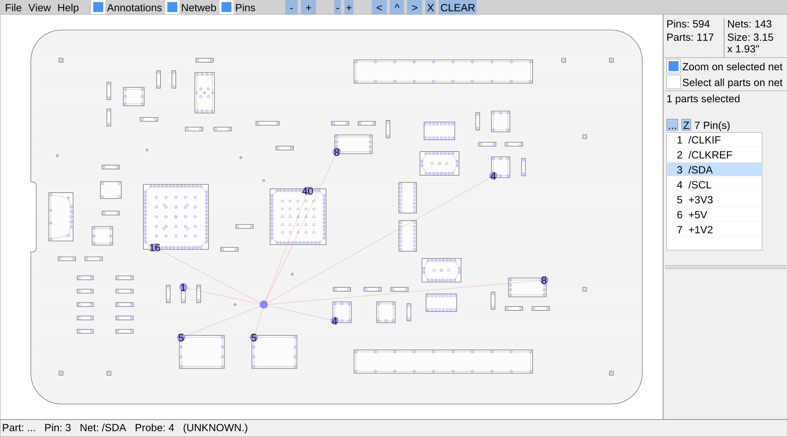
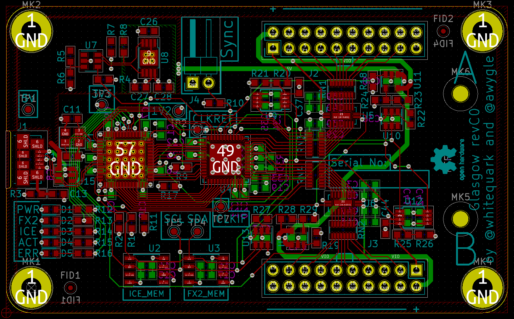

# KiCAD to Boardview exporter

The _KiCAD to Boardview exporter_ reads KiCAD PCB layout files and writes _Boardview_ files. _Boardview_ is a set of file formats used in the industry for communicating important data about PCB in post-production stage, such as component, pin, and test point placement.

The _Boardview_ file formats do not typically have a specification or even a name. The _KiCAD to Boardview_ exporter writes ".brd" files with ASCII _Boardview_ data. These files can be opened with MIT-licensed [OpenBoardView][].

[openboardview]: https://openboardview.org/

## Prerequisites

_KiCAD to Boardview exporter_ uses the [pcbnew plugin interface][pcbplugin]. It requires Python 2.7 with KiCAD libraries installed in the Python search path.

[pcbplugin]: https://kicad.readthedocs.io/en/latest/Documentation/development/pcbnew-plugins/

## Usage

Run the exporter as follows:

    ./pcbnew2boardview.py example/example.kicad_pcb example/example.brd

This will read the PCB layout from `example/example.kicad_pcb` and write it to `example/example.brd`.

## Examples

The _Boardview_ file for [Glasgow][] visualized with OpenBoardView looks like this, with the I2C SDA net selected:

For comparison, the PCB layout looks like this:

[glasgow]: https://github.com/whitequark/Glasgow

## Caveats

  * If the pin numbering on KiCAD modules does not start with pin 1 and continue consecutively until last pin with an integer name, the pin numbering on the boardview will be wrong.
  * Similarly to the previous caveat, the format does not allow to represent pin names such as `PAD` (on QFN packages) or `A0` (on BGA packages) correctly. These will be assigned arbitrary (but consistent) numbers instead.
  * There is an unknown field in the ".brd" files, written as `0`. It is ignored by OpenBoardView, but might actually mean something.

## License

_KiCAD to Boardview exporter_ is distributed under the terms of 0-clause BSD license.

See [LICENSE-0BSD](LICENSE-0BSD.txt) for details.
